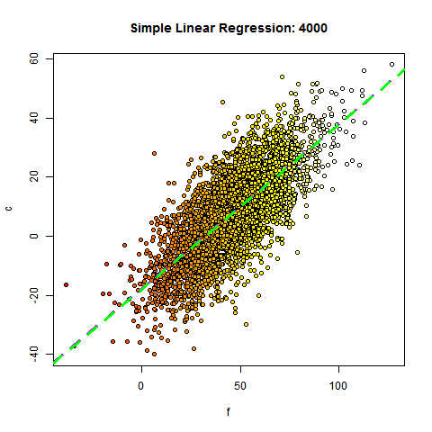

10. Download data
9. Read in CSV files
8. Slice and Visualize data
7. Explore the data graphically
6. Extend R with libraries
5. Load Excel data
4. Find missing data
3. Model missing values
2. Simple regression
1. Multiple regression modeling

